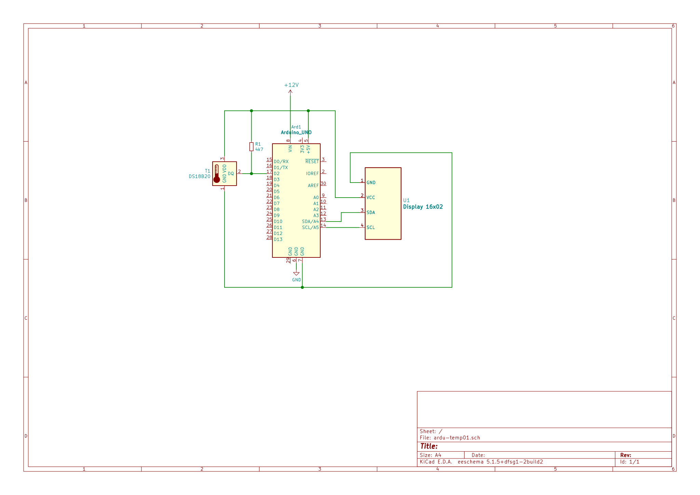

<h2><b>Software del dispositivo</b></h2>

Este código sirve para controlar el sensor digital DS1820 y mostrar la temperatura en una pantalla de cristal líquido con adaptador I2C. Primero que nada, debes descargar la librería <LiquidCrystal_I2C.h> (no confundir con <LiquidCrystal.h>, la librería para pantallas con 16 pines). Esta librería te permite controlar una pantalla de cristal líquido con adaptador I2C de 4 pines, la cual es mucho más práctica que la pantalla común de 16 pines.

Necesitarás las siguientes librerías para compilar el proyecto:

<ul>
<li> &lt;OneWire.h&gt; para el protocolo de comunicación</li>
<li> &lt;allasTemperature.h&gt; para registrar los datos del sensor DS1820</li>
<li>Y por supuesto, &lt;LiquidCrystal_I2C.h&gt; (no confundir con LiquidCrystal.h)</li>
</ul>

Para instalar cualquier librería, en tu IDE de Arduino ve a <b>Programa > Incluir librería > Administrar bibliotecas</b>, ahí debes poner el nombre de la librería en la barra del buscador. De los resultados que aparezcan, selecciona la librería con el nombre correcto  y dale a Instalar. Una vez instaladas las librerías, sólo es cuestión de compilar y subir el código a tu placa Arduino.

<h2><b>Materiales</b></h2>

Necesitarás los siguientes componentes:

<ul>
  <li>Placa Arduino Uno® (o imitación)</li>
  <li>Sensor de temperatura DS18B20</li>
  <li>Display 16x02 de caracteres, con adaptador I2C</li>
  <li>Resistencia 4.7 k&Omega;</li>
  <li>Fuente de alimentación de 9-12 V
  <li>Varios cables para Arduino</li>
  <li>Protoboard o placa PCB (puede basarse en el esquema PDF que dejé en la carpeta)</li>
</ul>

Con estos materiales, sólo debemos unir las piezas siguiendo el esquema que dejaré acá abajo (lo puedes descargar en formato PDF desde la carpeta del proyecto).

